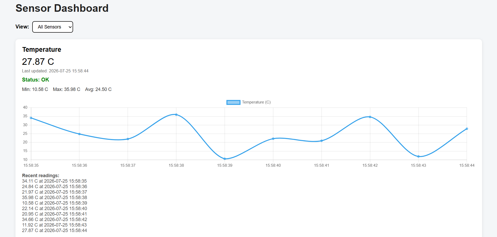

# C++ Sensor Dashboard

A multithreaded C++17 sensor simulation and monitoring application with a JSON HTTP API and browser-based dashboard.

The project simulates IoT-style sensors such as temperature, humidity, and voltage. A background C++ thread updates sensor readings while the HTTP API exposes current values, status information, recent history, and calculated statistics to a JavaScript frontend.

It demonstrates practical use of modern C++ concepts including thread synchronization, RAII, smart pointers, STL containers and algorithms, JSON serialization, configuration-driven design, and HTTP API development.

## Screenshot



## What I Built

- Multithreaded sensor simulation in C++17
- Thread-safe shared sensor state using `std::mutex` and `std::lock_guard`
- Background readings updated every second
- JSON HTTP API using `cpp-httplib`
- Configuration-driven sensor definitions
- Validation and error handling for invalid configuration
- Bounded recent-reading history for each sensor
- Minimum, maximum, and average calculations
- `OK`, `LOW`, and `HIGH` warning-state detection
- Single-sensor and sensor-history API endpoints
- Browser dashboard built with HTML, CSS, and JavaScript
- Chart.js graphs for recent readings
- Automatic frontend refresh every two seconds

## Tech Stack

- C++17
- CMake
- cpp-httplib
- nlohmann/json
- HTML
- CSS
- JavaScript
- Chart.js

## C++ Concepts Demonstrated

This project focuses on several important modern C++ concepts:

* Classes and encapsulation
* Header/source file separation
* Constructors
* Smart pointers with `std::unique_ptr`
* RAII principles
* Move semantics with `std::move`
* STL containers:

  * `std::vector`
  * `std::deque`
* STL algorithms:

  * `std::min_element`
  * `std::max_element`
  * `std::accumulate`
* Structs for richer data records
* Multithreading with `std::thread`
* Thread synchronization with `std::mutex`
* Safe locking with `std::lock_guard`
* Atomic variables with `std::atomic`
* Time handling with `std::chrono`
* File reading with `std::ifstream`
* JSON parsing and serialization
* Basic HTTP API design
* Configuration-driven design
* Defensive programming and validation

## Project Structure

```text
cpp-sensor-dashboard/
│
├── CMakeLists.txt
├── main.cpp
├── README.md
├── .gitignore
├── LICENSE
│
├── config/
│   └── sensors.json
│
├── include/
│   ├── Sensor.hpp
│   ├── SensorManager.hpp
│   ├── httplib.h
│   └── json.hpp
│
├── src/
│   ├── Sensor.cpp
│   └── SensorManager.cpp
│
├── frontend/
│   └── index.html
│
└── assets/
    └── dashboard-screenshot.png
```

## How It Works

The application has two main parts:

```text
C++ Backend
↓
HTTP JSON API
↓
HTML/CSS/JavaScript Frontend
```

The backend loads sensor definitions from a JSON config file.

Each sensor has:

* Name
* Unit
* Random generated value range
* Safe warning range

A background thread updates sensor values every second. The backend stores the latest value, timestamp, recent history, and calculated statistics.

The frontend calls the backend API every few seconds and updates the dashboard automatically.

## Sensor Configuration

Sensors are defined in:

```text
config/sensors.json
```

Example:

```json
{
  "sensors": [
    {
      "name": "Temperature",
      "unit": "C",
      "minValue": 10.0,
      "maxValue": 40.0,
      "warningLow": 20.0,
      "warningHigh": 30.0
    },
    {
      "name": "Humidity",
      "unit": "%",
      "minValue": 10.0,
      "maxValue": 90.0,
      "warningLow": 30.0,
      "warningHigh": 65.0
    },
    {
      "name": "Voltage",
      "unit": "V",
      "minValue": 2.5,
      "maxValue": 3.8,
      "warningLow": 3.1,
      "warningHigh": 3.5
    }
  ]
}
```

This means sensors can be changed without editing the C++ source code.

## Sensor Status Logic

Each sensor has two ranges:

1. Generated value range
2. Safe operating range

Example:

```text
Temperature generated range: 10.0°C to 40.0°C
Temperature safe range:      20.0°C to 30.0°C
```

If the value is below the safe range, the status becomes:

```text
LOW
```

If the value is above the safe range, the status becomes:

```text
HIGH
```

Otherwise, the status is:

```text
OK
```

## API Endpoints

### Health Check

```text
GET /health
```

Example response:

```json
{
  "status": "ok"
}
```

### Get All Sensors

```text
GET /sensors
```

Example response:

```json
{
  "sensors": [
    {
      "average": 25.67,
      "history": [
        {
          "timestamp": "2026-07-25 14:30:01",
          "value": 24.12
        }
      ],
      "max": 27.3,
      "min": 24.12,
      "name": "Temperature",
      "status": "OK",
      "timestamp": "2026-07-25 14:30:01",
      "unit": "C",
      "value": 27.3
    }
  ]
}
```

### Get One Sensor

```text
GET /sensors/Temperature
```

Example response:

```json
{
  "average": 25.67,
  "history": [
    {
      "timestamp": "2026-07-25 14:30:01",
      "value": 24.12
    }
  ],
  "max": 27.3,
  "min": 24.12,
  "name": "Temperature",
  "status": "OK",
  "timestamp": "2026-07-25 14:30:01",
  "unit": "C",
  "value": 27.3
}
```

### Get Sensor History

```text
GET /sensors/Temperature/history
```

Example response:

```json
{
  "name": "Temperature",
  "unit": "C",
  "history": [
    {
      "timestamp": "2026-07-25 14:30:01",
      "value": 24.12
    },
    {
      "timestamp": "2026-07-25 14:30:02",
      "value": 26.45
    }
  ]
}
```

## How to Build

### Requirements

You need:

* A C++17-compatible compiler
* CMake
* Git
* A browser

On Windows, you can use:

* Visual Studio Community
* Visual Studio Build Tools
* VS Code with the CMake Tools extension

### Build Instructions

From the project root folder:

```bash
mkdir build
cd build
cmake ..
cmake --build .
```

## How to Run

From the build folder, run the executable.

On Windows with the Visual Studio generator:

```powershell
.\Debug\sensor_dashboard.exe
```

Or, depending on your build setup:

```powershell
.\sensor_dashboard.exe
```

When the backend starts, you should see:

```text
Sensor Dashboard backend running at http://localhost:8080
Open http://localhost:8080/health to test the server.
Open http://localhost:8080/sensors to see sensor data.
```

## Test the Backend

Open these URLs in your browser:

```text
http://localhost:8080/health
```

```text
http://localhost:8080/sensors
```

```text
http://localhost:8080/sensors/Temperature
```

```text
http://localhost:8080/sensors/Temperature/history
```

## Run the Frontend

Keep the C++ backend running.

Then open:

```text
frontend/index.html
```

in your browser.

The dashboard displays:

* Latest value
* Unit
* Last updated timestamp
* Sensor status
* Min value
* Max value
* Average value
* Recent readings
* Line chart for history
* Dropdown filter for individual sensors

## Example Sensors

The default configuration includes:

* Temperature sensor
* Humidity sensor
* Voltage sensor

More sensors can be added by editing:

```text
config/sensors.json
```

## Future Improvements

Possible future upgrades:

* Add WebSocket live updates
* Save readings to SQLite
* Add unit tests with GoogleTest
* Add Docker support
* Add a React frontend
* Add sensor enable/disable controls
* Add CSV export for sensor history
* Add authentication for API endpoints

## Learning Purpose

This project was created to practice modern C++ through a realistic small application.

It is intentionally small enough to understand as a beginner project, but it includes important real-world software concepts such as:

* Backend APIs
* Thread-safe shared data
* Sensor-style simulation
* JSON configuration
* JSON serialization
* Frontend-backend communication
* Dashboard data visualization
* Clean project structure
